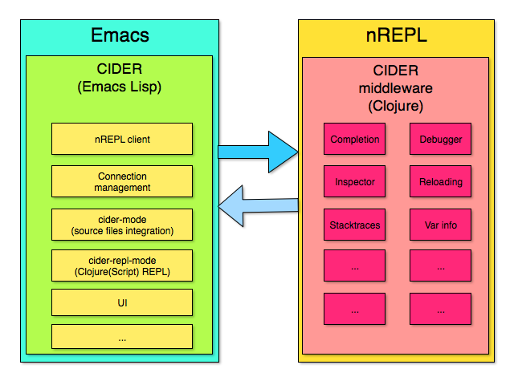
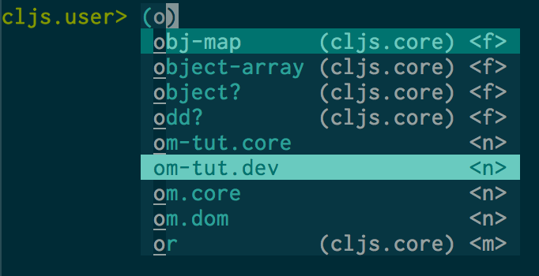

[![License GPL 3][badge-license]](http://www.gnu.org/licenses/gpl-3.0.txt)
[](http://melpa.org/#/cider)
[](http://stable.melpa.org/#/cider)
[](https://travis-ci.org/clojure-emacs/cider)
[](https://www.paypal.com/cgi-bin/webscr?cmd=_s-xclick&hosted_button_id=GRQKNBM6P8VRQ)

<p align="center">
  
</p>

CIDER (formerly *nrepl.el*) is the **C**lojure **I**nteractive **D**evelopment
**E**nvironment that **R**ocks!

CIDER 扩展了在 Emacs 里 交互式的方式进行clojure编程的功能。 
本文描述的CIDER的特性围绕 `cider-mode`这个辅助模式，作为主模式
`clojure-mode`补充.`clojure-mode`主模式支持编辑Clojure源代码,
`cider-mode` 辅助模式增加了在交互式编程过程中与一个运行的clojure repl程序之间编译，调试，定义以及查找文档，运行单元测试等等功能。

在CIDER 产生之前在Emacs里进行Clojure编程需要使用[SLIME][] +
[swank-clojure][],但是有了CIDER之后,就不需要前俩了。

如果你喜欢这个project, 请点击 [supporting its ongoing development](#donations).

[](https://gitter.im/clojure-emacs/cider?utm_source=badge&utm_medium=badge&utm_campaign=pr-badge&utm_content=badge)

**本文根据 CIDER主版本翻译从中文 ( v0.10.0) 如果你需要查看过去的版本说明，请checkout其他版本

***

- [概览](#overview)
- [安装](#installation)
  - [前置条件](#prerequisites)
  - [通过 package.el安装](#installation-via-packageel)
  - [设置 CIDER's nREPL 中间件](#setting-up-ciders-nrepl-middleware)
    - [使用 Leiningen](#using-leiningen)
    - [使用 Boot](#using-boot)
    - [使用 embedded nREPL server](#using-embedded-nrepl-server)
- [基本操作](#basic-usage)
  - [设定一个 Leiningen 或者 启动工程 project (可选)](#setting-up-a-leiningen-or-boot-project-optional)
  - [在EMACS里启动一个 nREPL 服务器和客户端](#launch-a-nrepl-server-and-client-from-emacs)
  - [连接到一个正在运行的nREPL服务器](#connect-to-a-running-nrepl-server)
  - [使用 cider-mode](#using-cider-mode)
  - [使用 REPL](#using-the-repl)
    - [REPL 配置](#repl-configuration)
      - [REPL 历史](#repl-history)
  - [在编辑ClojureScript时如何使用](#clojurescript-usage)
- [高级操作](#extended-workflow)
  - [手动扩展宏](#macroexpansion)
  - [值的检查](#value-inspection)
  - [运行单元测试](#running-tests)
  - [查看运行调用栈的操作](#navigating-stacktraces)
  - [调试](#debugging)
  - [重新载入代码](#code-reloading)
  - [管理多个连接](#managing-multiple-connections)
- [修改配置](#configuration)
  - [基本配置](#basic-configuration)
  - [Overlays](#overlays)
  - [设置代码缩进](#specifying-indentation)
  - [Minibuffer 命令补全](#minibuffer-completion)
  - [自动补全功能](#auto-completion)
  - [同时使用其他有用的模式](#integration-with-other-modes)
- [附加说明](#caveats)
  - [变量元数据](#var-metadata)
  - [ClojureScript 局限性](#clojurescript-limitations)
  - [微软Windows系统特殊部分](#microsoft-windows)
  - [powershell.el](#powershell-el)
- [疑难问题处理](#troubleshooting)
- [文档](#documentation)
- [修改日志](#changelog)
- [团队](#team)
- [版本发布策略](#release-policy)
- [Logo](#logo)
- [提交](#contributing)
  - [讨论交流](#discussion)
  - [问题列表](#issues)
  - [补丁](#patches)
  - [文档](#documentation)
  - [捐赠](#donations)
  - [批量运行测试](#running-the-tests-in-batch-mode)
- [License](#license)

## Overview

CIDER 意在提供一个跟过去的Emacs Lisp, Common Lisp (with [SLIME][] or [Sly][]),
Scheme (with [Geiser][]) Smalltalk等的 nREPL(1.读取，2.直行，3.打印，从1-3循环)的交互式编程环境。

程序员喜欢使用动态，递增的编程方式，频繁的运行已有的clojure代码以及增加新功能代码，
在使用CIDER操作nREPL时你不需要经常启动/停止你的clojure程序，就像在命令行里面一样，在一个命名空间下，改变命名空间里的程序，并且随时运行和测试它。


 `基本使用`这一节描述基本的CIDER详细的工作流程！
 参看如下视频，关于SLIME的交互式开发与编程方法。
[tutorial about SLIME](https://www.youtube.com/watch?v=_B_4vhsmRRI)  
CIDER 和 SLIME有很多不同 但是核心思路非常相似！CIDER借鉴了SLIME的很多功能。

CIDER's 的功能基于 [nREPL][],  nREPL是 Clojure的一个网络REPL服务器（所以你可以远程给飞机换发动机）.

CIDER 基本结构如下图:

<p align="center">
  
</p>

Clojure 代码通过nREPL server执行. CIDER 客户端发送执行代码的请求并且接受执行结果. The server's functionality is augmented by
additional nREPL middleware, designed specifically to address the needs of an
interactive development environment like CIDER. Much of the middleware we
developed for CIDER is editor agnostic and is being used by other Clojure dev
environments as well (e.g. [vim-fireplace][] & [CCW][]).

CIDER的发展历史和结构
1.[The Evolution of the Emacs tooling for Clojure](https://www.youtube.com/watch?v=4X-1fJm25Ww&list=PLZdCLR02grLoc322bYirANEso3mmzvCiI&index=6)
2. [Cognicast's episode on CIDER](http://blog.cognitect.com/cognicast/080).
3.[ClojureX 2015 presentation](https://skillsmatter.com/skillscasts/7225-cider-the-journey-so-far-and-the-road-ahead)


CIDER 打包了如下列功能：(顺序是随机的):

* 强大的 REPL
* 交互式的执行代码
* 编译提示 (高亮错误和警告)
* 方便可读的调用堆栈提示
* 智能代码补全
* 在代码定义和调用之间跳转
* 查找文档
* 查找网络资源
* Apropos
* 调试器
* 值查看器
* 函数 Tracing
* 交互的方式展开一个宏
* 增强的代码字体和缩进
* [Grimoire](http://conj.io/) 集成
* `clojure.test` 集成
* Classpath 浏览器
* Namespace 浏览器
* nREPL session 管理
* Scratchpad
* Minibuffer 执行代码
* 集成 [company-mode][] 和 [auto-complete-mode][]用于代码补全
* 多个 nREPL 连接的支持


## 安装

常用的安装方法是通过   `package.el` (Emacs's built-in package
manager)安装,但是也有其他方法
[wiki](https://github.com/clojure-emacs/cider/wiki/Installation)).

### 前置准备工作

装Emacs，CIDER官方支持Emacs 24.3+和Clojure 1.5+
Emacs新手请参看 [this tutorial](http://clojure-doc.org/articles/tutorials/emacs.html),


使用最新的构建工具(Leiningen, Boot
or Gradle) 通过`M-x` +  `cider-jack-in`.开启CIDER功能.

#### 从 nrepl.el 升级(原来使用nrepl.el的老用户，nrepl-ritz老用户请看)
删掉 `nrepl.el`和所有依赖它的包.删掉nrepl-ritz
（下面这句是 李锋 87260280@qq.com 自己说的，新用户建议安装全新的环境，使用CIDER和Prelude就够了）


#### 从 clojure-test-mode 升级

CIDER 0.7 使用`cider-test`.  替换了 `clojure-test-mode` 

### 从 package.el 安装

`package.el` is the built-in package manager in Emacs.

CIDER 保存在两个主要的 `package.el` 社区维护的 repos -
[MELPA Stable](http://stable.melpa.org)
and [MELPA](http://melpa.org).

通过如下命令安装CIDER:

<kbd>M-x package-install [RET] cider [RET]</kbd>

或者把下面这行加到Emacs的初始化文档里：
(`.emacs` or `init.el`):

```el
(unless (package-installed-p 'cider)
  (package-install 'cider))
```

如果安装后没反应请执行一下刷新:

<kbd>M-x package-refresh-contents [RET]</kbd>

请留意：MELPA 是自动从 `master` 分支随时构建,可能会有小bug. 不管怎么说, 推荐从 MELPA 安装, 因为主分支还是比较稳定的，并且对功能的更新比stable要快一些

把下面这行加到初始化文件，会自动检查稳定版本:

```el
(add-to-list 'package-pinned-packages '(cider . "melpa-stable") t)
```

**CIDER 有一些依赖 (e.g. `queue` & `seq`) 只存在于
  [GNU ELPA repository](https://elpa.gnu.org/). 这是你唯一需要关闭的包**

### 设置 CIDER's nREPL middleware

CIDER的很多功能依赖于这个中间件
[nREPL middleware][cider-nrepl].

#### 使用 Leiningen

默认使用习惯插件，在工程文件`project.clj` 里配置
或者  `~/.lein/profiles.clj`的 :repl

```clojure
:plugins [[cider/cider-nrepl "x.y.z"]]
```

一个CIDER的最小配置 `profiles.clj` 如：

```clojure
{:repl {:plugins [[cider/cider-nrepl "0.10.0"]]}}
```

**注意不要在 `:user` 配置, 因为这样的话 CIDER的
middleware 每次都会载入, 造成 `lein` 启动缓慢.  你只需要在执行 `lein repl`命令时 或者 配置文件的`:repl` 里配置 .**

#### 使用 Boot

Boot 用户请配置 `~/.boot/profile.boot`:

```clojure
(require 'boot.repl)

(swap! boot.repl/*default-dependencies*
       concat '[[cider/cider-nrepl "0.10.0"]])

(swap! boot.repl/*default-middleware*
       conj 'cider.nrepl/cider-middleware)
```

更多信息请参考 [boot-clj wiki](https://github.com/boot-clj/boot/wiki/Cider-REPL).

#### 使用内置的 nREPL server

如果你使用你自己的程序内置的nREPL，你需要在CIDER启动时配置.

```clojure
(ns my-app
  (:require [clojure.tools.nrepl.server :as nrepl-server]
            [cider.nrepl :refer (cider-nrepl-handler)]))

(defn -main
  []
  (nrepl-server/start-server :port 7888 :handler cider-nrepl-handler))
```

它不会提示你需要依赖 `cider-nrepl`.

***

`x.y.z` 插件的版本号需要匹配 CIDER版本号，比如你现在使用( `0.7.1`).
CIDER 快照发布版本 你应该使用的插件同样应该是( `0.7.1-SNAPSHOT`).

**cider-nrepl 版本不能低于CIDER版本**

## 基本操作

启动Emacs，打开project.clj文件，然后执行 M-x  `cider-jack-in` 命令

### Setting up a Leiningen or Boot project (optional)

[Leiningen][] 事实上的构建标准. [Boot][] 是一个更新的能有更多定制功能的工具
.他们都支持 Maven Java构建工具 (并且实际上使用了很多 Maven ecosystem的现成的功能).

CIDER 执行 M-x  `cider-jack-in` 命令 依赖Leiningen 2.x (preferably 2.5+) 或者 Boot
2.0.0+. 老版本不支持
如果用leiningen的话，比如：

```
$ lein new demo
```

### 在Emacs里启动nRepl服务

在当前工程下随便打开一个*.clj文件，输入 <kbd>M-x cider-jack-in</kbd>. 就会自动启动CIDER
 <kbd>C-u M-x cider-jack-in</kbd> 设定启动哪一个 `lein` 或者 `boot` 工程,

在 Clojure(Script) 缓冲列表里  `cider-jack-in` 绑定的快捷键是 <kbd>C-c M-j</kbd>.

### 连接到一个已有的nRepl

在project's dir 下在终端里输入
(假设你使用 Leiningen ):

```
$ lein repl
```

或者使用 Boot 的话:

```
$ boot repl wait
```

nREPL启动后，回到Emacs输入 <kbd>M-x cider-connect</kbd> 你就连过去了.

在 Clojure(Script)里 `cider-connect` 快捷键绑定为： <kbd>C-c M-c</kbd>.

### 使用 cider-mode（最重要的部分来了）

CIDER 使用 `cider-mode` 辅助模式(作为主模式的补充
`clojure-mode`) 在REPL 中执行代码或者及时加载你的源代码文件.  下面是在Emacs中 cider-mode的快捷键(当前活动窗口是*.clj文件):

           快捷键                    | 功能描述
-------------------------------------|-------------------------------
<kbd>C-x C-e</kbd> <kbd>C-c C-e</kbd>| 执行当前鼠标位置往上的最近的一段form并且显示结果在回显区，和/或 覆盖缓冲区 (根据 `cider-use-overlays`).  如果前面加了overlays, 结果插入当前缓冲区.
<kbd>C-c C-w</kbd>                   | 执行当前鼠标位置往上的最近的一段form并且用结果替代代码.
<kbd>C-c M-e</kbd>                   | 执行当前鼠标位置往上的最近的一段form并且输出到 REPL buffer. 如带参数会切到参数所指REPL buffer.
<kbd>C-c M-p</kbd>                   | 当前鼠标位置往上的最近的一段form复制到 REPL buffer.
<kbd>C-c C-p</kbd>                   | 执行当前鼠标位置往上的最近的一段form并且 pretty-print 输出到新的 buffer.
<kbd>C-c C-f</kbd>                   | 执行当前鼠标位置往上的最顶层的一段form pretty-print the result in a popup buffer.
<kbd>C-M-x</kbd> <kbd>C-c C-c</kbd>  | 执行当前鼠标位置往上的最顶层的一段form and display the result in the echo area.
<kbd>C-u C-M-x</kbd> <kbd>C-u C-c C-c</kbd>  | Debug 当前鼠标位置往上的最顶层的一段form 单步执行
<kbd>C-c C-r</kbd>                   | 执行选定区域代码在回显区显示结果.
<kbd>C-c C-b</kbd>                   | 中断以上操作中任何正在执行的代码.
<kbd>C-c C-m</kbd>                   | 当前鼠标位置form 调用 `macroexpand-1`  输出结果到macroexpansion buffer.  如果有前置参数会执行 `macroexpand`  
<kbd>C-c M-m</kbd>                   | 当前鼠标位置form 调用 `clojure.walk/macroexpand-all`  输出结果到 macroexpansion buffer.
<kbd>C-c C-n</kbd>                   | 执行 ns form.
<kbd>C-c M-n</kbd>                   | 把当前文件buffer的命名空间加载到nREPL.
<kbd>C-c C-z</kbd>                   | 切换到nRepl 缓冲区. 使用 prefix 参数改变命名空间为当前文件的命名空间.
<kbd>C-u C-u C-c C-z</kbd>           | 切换到nRepl 缓冲区基于你在提示符后输入的目录名.
<kbd>C-c M-z</kbd>                   | 加载执行当前buffer并且切到相邻的nREPL buffer. Use a prefix argument to change the namespace of the REPL buffer to match the currently visited source file.
<kbd>C-c M-d</kbd>                   | 显示默认REPL连接的详细信息, 包括工程目录名, 缓冲区命名空间, 主机名和端口号.
<kbd>C-c M-r</kbd>                   | 旋转并且显示默认的 nREPL 连接.
<kbd>C-c C-o</kbd>                   | 清除nREPL最后一行.前面加参数的话会清除整个缓冲区,只留下提示符.如果你左右分屏打开编辑和运行窗口的话比较有用。
<kbd>C-c C-k</kbd>                   | 加载执行当前文件的buffer.(最常用的命令，相当于编译).
<kbd>C-c C-l</kbd>                   | 加载执行当前文件.（最常用的命令，相当于编译）.
<kbd>C-c C-x</kbd>                   | 重新加载classpath上所有已经修改的文件. 如果加前置参数，加载所有classpath上的文件.加载所有classpath上的文件.调用时加双prefix参数, 会清除命名空间reload之前的tracer的状态.
<kbd>C-c C-d d</kbd>                 | 显示当前光标位置符号的文档. 用前置参数调用或者未找到符号会提示输入symbol.
<kbd>C-c C-d j</kbd>                 | 在默认浏览器里为光标位置符号显示javadoc.  用前置参数调用或者未找到符号会提示输入symbol
<kbd>C-c M-i</kbd>                   | Inspect 当前光标位置的表达式，如果存在的话.
<kbd>C-c M-t v</kbd>                 | 开启变量  tracing.
<kbd>C-c M-t n</kbd>                 | 开启命名空间 tracing.
<kbd>C-c C-u</kbd>                   | 清除符号定义. 用前置参数调用或者未找到符号会提示输入symbol.
<kbd>C-c ,</kbd>                     | 运行当前文件的单元测试文件(需要根据路径定义单元测试文件 (ns project.model.namespace-test)).
<kbd>C-c C-,</kbd>                   | 重新运行失败或者错误的测试用例.
<kbd>C-c M-,</kbd>                   | 运行当前位置的测试用例.
<kbd>C-c C-t</kbd>                   | 显示测试报告的buffer.
<kbd>M-.</kbd>                       | 跳转到符号定义buffer.  用前置参数调用或者未找到符号会提示输入symbol.
<kbd>C-c M-.</kbd>                   | 跳转道字符串定义的资源的buffer.
<kbd>C-c C-.</kbd>                   | 跳转到classpath的某个命名空间.
<kbd>M-,</kbd>                       | 返回之前条转过来的位置.
<kbd>M-TAB</kbd>                     | 补全当前位置的symbol.
<kbd>C-c C-d r</kbd>                 | 在 Grimoire 中查找symbol.
<kbd>C-c C-d a</kbd>                 | Apropos 搜搜 functions/vars.
<kbd>C-c C-d A</kbd>                 | Apropos 搜索 documentation.
<kbd>C-c C-q</kbd>                   | 退出当前nREPL连接. 用前置参数调用会退出所有的连接.

你不需要记这个列表里的快捷键. CIDER菜单 会在Emacs菜单里. 通过 `C-h f RET cider-mode` 可以获取 `cider-mode`的快捷键.

### 使用  REPL   (REPL会在另外一个buffer出现，一般工作的时候通过C x 3 打开水平的双分屏，一边编辑源码，另一边执行和测试)

CIDER repl子模式有很多功能可以再 读取执行打印的过程中跟你的源代码交互:

* 自动补全
* 字体锁定 (和 `clojure-mode` 一样)
* 快速进入CIDER命令 (e.g. 查找定义和文档, 跟踪等)

CIDER's REPL 快捷键:

Keyboard shortcut                    | Description
-------------------------------------|------------------------------
<kbd>RET</kbd>        | 如果输入的是一个完整的form，执行它. 如果不完整，则换行继续输入.如果带有前置参数则不检查完整性，直接执行.
<kbd>C-RET</kbd>      | 补全不当前form不完整的括号对，然后执行并输出.
<kbd>C-j</kbd>        | 开启新行并缩进
<kbd>C-c C-o</kbd>    | Remove the output of the previous evaluation from the REPL buffer. With a prefix argument it will clear the entire REPL buffer, leaving only a prompt.
<kbd>C-c M-o</kbd>    | 在当前工程的 Clojure 和 ClojureScript REPLs 中切换.
<kbd>C-c C-u</kbd>    | 删除左侧所有字符.
<kbd>C-c C-b</kbd> <kbd>C-c C-c</kbd>| 中断当前nREPL里的所有执行中的程序.
<kbd>C-up</kbd> <kbd>C-down</kbd> | 在输入历史中前后切换,可以用于重复执行上一次的代码.
<kbd>M-p</kbd> <kbd>M-n</kbd> | 用当前行的输入作为条件在历史输入中匹配. 如果 <kbd>M-p/M-n</kbd> 在同一行中输入两次,后面的搜索会以第一次的输入为搜索条件.
<kbd>M-s</kbd> <kbd>M-r</kbd> | 用正则方式在命令中搜索.
<kbd>C-c C-n</kbd> <kbd>C-c C-p</kbd> | 在命令提示符中上下跳转. 回车 <kbd>RET</kbd> 则复制当前行到最前面的命令行提示符，用于重复执行代码.
<kbd>C-c C-x</kbd>     | 重新Load classpath中修改过的文件.
<kbd>C-u C-c C-x</kbd> | 重新Load classpath中的所有文件.
<kbd>TAB</kbd>         | 和Linux终端类似，补全符号.
<kbd>C-c C-d d</kbd>   | 显示光标所在处的symbol的文档.  如果带有前置参数, 或者当前没有symbol, 则提示输入symbol
<kbd>C-c C-d j</kbd>   | 打开默认浏览器，显示光标所在处的symbol的JavaDoc文档.  如果带有前置参数, 或者当前没有symbol, 则提示输入symbol
<kbd>C-c C-d r</kbd>   | 在Grimoire中搜索文档.
<kbd>C-c C-d a</kbd>   | Apropos 搜索 functions/vars.
<kbd>C-c C-d A</kbd>   | Apropos 搜索文档.
<kbd>C-c C-z</kbd>     | 切换到前一个nREPL. 作为 <kbd>C-c C-z</kbd> 在 cider-mode里的补充.
<kbd>C-c M-i</kbd>     | Inspect 光标处的表达式.
<kbd>C-c M-n</kbd>     | 在clj文件编辑的时候，切到当前命名空间，在nREPL里，则切换命名空间，在回显区中选择.
<kbd>C-c C-.</kbd>     | 跳到classpath里的某个命名空间.
<kbd>C-c M-t v</kbd>   |  开启变量tracing .
<kbd>C-c M-t n</kbd>   | 开启命名空间 tracing.
<kbd>C-c C-q</kbd>     | 退出当前 nREPL连接.如果带有前置参数,则退出所有连接.

这些快捷键不需要记 EMacs菜单上会有`REPL`项，列表里有所有的功能和快捷键绑定  `C-h f RET cider-repl-mode` 查看 `cider-repl-mode`.快捷键
在nREPL提示符输入`,`会提示可输入的命令.
通过以下设置
`cider-repl-shortcut-dispatch-char`. Here's how you can change it to `:`:

```el
(setq cider-repl-shortcut-dispatch-char ?\:)
```

#### REPL 配置修改(部分翻译！)

* 定制 REPL 提示符:
  `cider-repl-prompt-function` 接受带一个参数的函数,
  命名空间名称. 以下三个是已有的备选:
  `cider-repl-prompt-lastname`, `cider-repl-prompt-abbreviated`,
  `cider-repl-prompt-default` 默认最后一个被使用.
  例如在命名空间`leiningen.core.ssl`:

  * `cider-repl-prompt-lastname`:

  ```
  ssl>
  ```

  * `cider-repl-prompt-abbreviated`:

  ```
  l.c.ssl>
  ```

  * `cider-repl-prompt-default`:

  ```
  leiningen.core.ssl>
  ```

  当然你可以自己写一个函数.例如 在 `leiningen` 里有2个命名空间有相似的名字  - `leiningen.classpath` 和
  `leiningen.core.classpath`. 设定以下可以区分你的不同的nREPL:

  ```el
  (defun cider-repl-prompt-show-two (namespace)
    "Return a prompt string with the last name in NAMESPACE."
    (let* ((names (reverse (-take 2 (reverse (split-string namespace "\\."))))))
      (concat (car names) "." (cadr names) "> ")))
  ```

* By default, interactive commands that require a symbol will prompt for the
  symbol, with the prompt defaulting to the symbol at point. You can set
  `cider-prompt-for-symbol` to nil to instead try the command with the symbol at
  point first, and only prompt if that fails.

* You can control the <kbd>TAB</kbd> key behavior in the REPL via the
`cider-repl-tab-command` variable.  While the default command
`cider-repl-indent-and-complete-symbol` should be an adequate choice for
most users, it's very easy to switch to another command if you wish
to. For instance if you'd like <kbd>TAB</kbd> to only indent (maybe
because you're used to completing with <kbd>M-TAB</kbd>) use the
following snippet:

```el
(setq cider-repl-tab-command #'indent-for-tab-command)
```

* Change the result prefix for REPL evaluation (by default there's no prefix):

```el
(setq cider-repl-result-prefix ";; => ")
```

And here's the result of that change:

```
user> (+ 1 2)
;; => 3
```

* The REPL buffer name has the format `*cider-repl project-name*`.
Change the separator from space to something else by overriding `nrepl-buffer-name-separator`.

```el
(setq nrepl-buffer-name-separator "-")
```

* The REPL buffer name can also display the port on which the nREPL server is running.
Buffer name will look like *cider-repl project-name:port*.

```el
(setq nrepl-buffer-name-show-port t)
```

* Normally code in the REPL is font-locked the same way as in
`clojure-mode`. Before CIDER 0.10 by default REPL input was font-locked with
`cider-repl-input-face` (after you press `RET`) and results were font-locked with
`cider-repl-result-face`. If you want to restore the old behaviour use:

```el
(setq cider-repl-use-clojure-font-lock nil)
```

##### REPL 里使用prety print（美化输出）

 `(def a 1) (def b2)` 这样的forms 不支持。
 需要require引入 `clojure.pprint` 才行
(Clojure早期版本的pprint命名空间不同):

<kbd>M-x cider-repl-toggle-pretty-printing</kbd>

##### 限制REPL输出长度  

太长的print会阻塞当前输入，通过设定`*print-length*` 限制
你可以设置 Leiningen 工程文件的`repl-options` 配置

```clojure
:repl-options {:init (set! *print-length* 50)}
```

##### REPL 命令历史

* 自动换行:

```el
(setq cider-repl-wrap-history t)
```

* 历史命令缓冲保留长度:

```el
(setq cider-repl-history-size 1000) ; the default is 500
```

* 保存到文件:

```el
(setq cider-repl-history-file "path/to/file")
```

kill buffer的时候history已经保存到文件 ( `cider-quit` 或者退出Emacs也会保存)


### ClojureScript 使用

ClojureScript 依赖
[piggieback][] nREPL 中间件.

1. 在 `project.clj`中添加依赖

   ```clojure
   [com.cemerick/piggieback "0.2.1"]
   [org.clojure/clojure "1.7.0"]
   ```

   再加上:

   ```clojure
   :repl-options {:nrepl-middleware [cemerick.piggieback/wrap-cljs-repl]}
   ```

2. 输入 <kbd>M-x</kbd> `customize-variable` <kbd>RET</kbd> `cider-cljs-repl` 如果你像改变你的 REPL 的JS（clojurescript需要编译成Js在js运行环境中执行）环境 (默认是 `rhino`).

3. 打开工程里的一个文件然后 <kbd>M-x</kbd>
   `cider-jack-in-clojurescript`. 会开启nREPL并且启动两个REPL   Clojure 和 ClojureScript各一个个.你访问 `clj` 或 `cljs` 两种不同文件时相应的CIDER 命令会自动导向相应的REPL.

#### 浏览器连接的 ClojureScript REPL

使用 Weasel, 你可以使用浏览器连接的 REPL.

1. 增加 `[weasel "0.7.0"]` 到工程文件的 `:dependencies`.

2. 敲 <kbd>M-x</kbd> `customize-variable` <kbd>RET</kbd> `cider-cljs-repl`
   选择 `Weasel` 选项.

3. 把如下代码加到你的ClojureScript 代码中:

   ```clojure
   (ns my.cljs.core
     (:require [weasel.repl :as repl]))
   (repl/connect "ws://localhost:9001")
   ```

4. 打开工程中的一个文件后敲 `M-x cider-jack-in-clojurescript`.

Piggieback-enabled ClojureScript 环境就在REPL session 中激活了
, load和eval代码不受 `cider-nrepl` 中间件的影响. 如果中间件是开着的如下功能不受影响(包括代码补全,
文档查找，命名空间浏览，宏扩展等).

## 更高级的工作流程

更多的辅助模式可以补充CIDER 没有提供的功能。

### 宏扩展

在form后面敲 <kbd>C-c C-m</kbd> 会显示宏扩展的结果. 更多功能将使用 `cider-macroexpansion-mode`):

           快捷键               | 描述
--------------------------------|-------------------------------
<kbd>C-c C-m</kbd>              | 对光标前的form执行 `macroexpand-1` ，如果带前缀, 会执行`macroexpand` 而不是 `macroexpand-1`.
<kbd>C-c M-m</kbd>              | 执行 `clojure.walk/macroexpand-all` 
<kbd>g</kbd>                    | 重复上一次的展开并替换当前结果.
<kbd>C-/</kbd> <kbd>C-x u</kbd> | 撤回一次展开.

### 值跟踪

使用(`cider-inspector-mode`)模式: 

           快捷键                       | 描述
----------------------------------------|-------------------------------
<kbd>Tab</kbd> and <kbd>Shift-Tab</kbd> | 浏览可跟踪的子对象
<kbd>Return</kbd>                       | 跟踪子对象
<kbd>l</kbd>                            | 回跳到上一层
<kbd>g</kbd>                            | 刷新跟踪器 (e.g. 比如在跟踪一个 atom/ref/agent)
<kbd>SPC</kbd>                          | 看下一页如果超过一页的话
<kbd>M-SPC</kbd>                        | 看上一页
<kbd>s</kbd>                            | 设定新的页长度

### 运行测试（非常有用的一部分）

你可以运行 `clojure.test` 测试. 在源代码中敲 <kbd>C-c
,</kbd> 会运行当前命名空间的测试. CIDER 会自动识别.

buffer会回显测试结果， 更多功能如下：

           快捷键               | 描述
--------------------------------|-------------------------------
<kbd>C-c ,</kbd>                | 运行当前命名空间的测试.
<kbd>C-c C-,</kbd>              | 重复运行失败或错误的测试.
<kbd>C-c M-,</kbd>              | 运行光标处的测试.
<kbd>M-p</kbd>                  | 跳到上一个.
<kbd>M-n</kbd>                  | 跳到下一个.
<kbd>t</kbd> and <kbd>M-.</kbd> | 调到测试定义.
<kbd>d</kbd>                    | 显示预期和实际结果.
<kbd>e</kbd>                    | 显示错误和调用栈.

如下操作可以配置:

* 如果你的测试用例命名空间不是以默认的 `some.ns-test` 方式你可以改变 `cider-test-infer-test-ns`. 它应该绑定以现有命名空间为输入，测试命名空间为输出的一个函数 (函数式编程).

* 设置查看所有的测试结果不管执行结果对错:

```el
(setq cider-test-show-report-on-success t)
```

### 调用栈浏览

使用(`cider-stacktrace-mode`)模式来过滤和在错误中跳转,如下单击操作可完成.

           快捷键               | 描述
--------------------------------|-------------------------------
<kbd>M-p</kbd> | 上一个原因
<kbd>M-n</kbd> | 下一个原因
<kbd>M-.</kbd> and <kbd>Return</kbd> | 跳到源码（如果有的话）
<kbd>Tab</kbd> | 循环显示当前错误原因
<kbd>0</kbd> and <kbd>S-Tab</kbd> | 循环显示所有错误原因
<kbd>1</kbd> | 循环显示 #1 详情
<kbd>2</kbd> | 循环显示 #2 详情
<kbd>3</kbd> | 循环显示 #3 详情
<kbd>4</kbd> | 循环显示 #4 详情
<kbd>5</kbd> | 循环显示 #5 详情
<kbd>j</kbd> | 以下为开启关闭显示 java 代码
<kbd>c</kbd> | 开启关闭显示clj 
<kbd>r</kbd> | repl
<kbd>t</kbd> | tooling (e.g. compiler, nREPL middleware)
<kbd>d</kbd> | 重复
<kbd>a</kbd> | 所有

* 可以统一设置`java`, `clj`, `repl`, `tooling`, 和 `dup`.   `nil` 为显示所有.

```el
(setq cider-stacktrace-default-filters '(tooling dup))
```

* 换行设置 `fill-column`

```el
(setq cider-stacktrace-fill-column 80)
```

### 调试

集中方式可以打开调试器, 最简单的 <kbd>C-u C-M-x</kbd>. 这会在Top level调试，请设置断点,
然后正常执行. 断点处会暂停，你可以check. 如果当前form是函数定义 `defn`, 则会再函数调用时暂停. 撤销敲 (e.g. <kbd>C-M-x</kbd>).

自己打断点也可以.在form前写`#break`，敲<kbd>C-M-x</kbd> 断点会触发 `(inspector msg)` .

```clojure
(defn eval-msg [{:keys [inspect] :as msg}]
  (if inspect
    #break (inspector msg)
    msg))
```

  `#dbg` 不同于  `#break`，不止form被暂停，所有代码都会生效  In the example above, this
places a breakpoint around `(inspector msg)` and another around `msg`. If you've
been paying attention, you may have noticed that the first option (<kbd>C-u
C-M-x</kbd>) is a quick way of evaluating the current top-level form with `#dbg`
in front.

At any point, you can bring up a list of all currently instrumented `def`s with
the command `cider-browse-instrumented-defs`. Protocols and types can be
instrumented as well, but they will not be listed by this command.

#### 快捷键

`cider-debug` 和
[Edebug](http://www.gnu.org/software/emacs/manual/html_node/elisp/Edebug.html).一致：

Keyboard shortcut               | Description
--------------------------------|-------------------------------
<kbd>n</kbd> | 下一步
<kbd>c</kbd> | 跳过断点
<kbd>o</kbd> | 跳出exp (like `up-list`)
<kbd>i</kbd> | 运行时修改值
<kbd>e</kbd> | 当前上下文执行代码
<kbd>l</kbd> | 跟踪本地变量
<kbd>q</kbd> | 退出debug

debug时，所有的有效命令 (如 <kbd>C-x C-e</kbd> or
<kbd>C-c M-:</kbd>) 会使用当前词法环境(本地变量)

### 代码重新加载(可以在运行时更新代码)

`cider-refresh` 封装了
[clojure.tools.namespace](https://github.com/clojure/tools.namespace), 参考这个
[benefits](https://github.com/clojure/tools.namespace#reloading-code-motivation)
和
[caveats](https://github.com/clojure/tools.namespace#reloading-code-preparing-your-application)
regarding writing reloadable code also apply.

调用 `cider-refresh` 会重新load所有命名空间被修改了的代码.单一前置参数可以经常性的check load代码 , 或者双前缀参数会 先清除当前命名空间状态然后再加载.

上面三个操作可以在如下模拟
[`clojure.tools.namespace.repl/refresh`](http://clojure.github.io/tools.namespace/#clojure.tools.namespace.repl/refresh),
[`clojure.tools.namespace.repl/refresh-all`](http://clojure.github.io/tools.namespace/#clojure.tools.namespace.repl/refresh-all)
和
[`clojure.tools.namespace.repl/clear`](http://clojure.github.io/tools.namespace/#clojure.tools.namespace.repl/clear)
(相应的紧跟着一个常规的刷新)

* reloading前和loading后你可以设置执行一个函数
* 
```el
(setq cider-refresh-before-fn "user/stop-system!"
      cider-refresh-after-fn "user/start-system!")
```

* 必须有效，无参. 同步阻塞并且默许副作用，串行执行

* 默认情况 `cider-refresh`会显示状态.并被写入 `*cider-refresh-log*` 缓冲区，被 `cider-refresh-before-fn` 和
  `cider-refresh-start-fn`.打印到`*out*` or `*err*` 也一样会写入

* 设置 `cider-refresh-show-log-buffer` 非nil值让 `*cider-refresh-log*` 自动显示
* 
```el
(setq cider-refresh-show-log-buffer t)
```

### 多个nREPL连接的切换与设置

多次敲<kbd>M-x cider-jack-in</kbd> (or
`cider-connect`) 可以连到多个nREPL .关闭连接敲
<kbd>M-x cider-quit</kbd>.

多个连接中只有一个是默认的， `cider-request-dispatch` 设置当他是 `'dynamic` (默认), CIDER 会通过当前工程和当前文档去判断;如果是`'static`  （CIDER 0.10 之前的版本是static) 则总是执行到默认的连接.

当前REPL <kbd>C-c M-d</kbd>
切换 <kbd>C-c M-r</kbd>. 
设置appropriate默认nRepl的另一个命令：
<kbd>M-x cider-make-connection-default</kbd>  

切换到相邻repl: <kbd>C-c C-z</kbd>. 重复一次则返回clojure文件

独立前缀 <kbd>C-u C-c C-z</kbd>, 会切到相邻nRepl并且设置命名空间为当前clojure文件的buffer所在命名空间

改变标示符： <kbd>M-x
cider-change-buffers-designation</kbd>. 如 `cider-change-buffers-designation` 加字符串 "foo" 会改变 `*cider-repl localhost*` 为 `*cider-repl foo*`.

## 更深度的定制（）

如下高级功能配置可以略过也可以参考

### 基本配置

* 打开 `eldoc` :

```el
(add-hook 'cider-mode-hook #'eldoc-mode)
```

* 新建clojure buffer时自动覆盖 `cider-mode` 在 `clojure-mode` buffers 上:

```el
(setq cider-auto-mode nil)
```


* 关掉通讯日志:

```el
(setq nrepl-log-messages nil)
```

Basically, this will dispose of the buffer `*nrepl-messages*`. The communication
log is invaluable for debugging CIDER issues, so you're generally advised to keep
it around.

* You can hide the `*nrepl-connection*` and `*nrepl-server*` buffers
from appearing in some buffer switching commands like
`switch-to-buffer`(<kbd>C-x b</kbd>) like this:

```el
(setq nrepl-hide-special-buffers t)
```

When using `switch-to-buffer`, pressing <kbd>SPC</kbd> after the command will
make the hidden buffers visible. They'll always be visible in
`list-buffers` (<kbd>C-x C-b</kbd>).

* To prefer local resources to remote (tramp) ones when both are available:

```el
(setq cider-prefer-local-resources t)
```

* Prevent the auto-display of the REPL buffer in a separate window
  after connection is established:

```el
(setq cider-repl-pop-to-buffer-on-connect nil)
```

* Configure whether the error buffer with stacktraces should be automatically
  shown on error:

  - Don't show on error:

    ```el
    (setq cider-show-error-buffer nil)
    ```

   Independently of the value of `cider-show-error-buffer`, the error buffer is
   always generated in the background. Use `cider-visit-error-buffer` to visit
   this buffer.

  - Selective strategies:

    ```el
    (setq cider-show-error-buffer 'except-in-repl) ; or
    (setq cider-show-error-buffer 'only-in-repl)
    ```

* To disable auto-selection of the error buffer when it's displayed:

```el
(setq cider-auto-select-error-buffer nil)
```

* Make <kbd>C-c C-z</kbd> switch to the CIDER REPL buffer in the current window:

```el
(setq cider-repl-display-in-current-window t)
```

* Prevent <kbd>C-c C-k</kbd> from prompting to save the file corresponding to
  the buffer being loaded, if it's modified:

```el
;; Don't prompt and don't save
(setq cider-prompt-save-file-on-load nil)
;; Just save without prompting
(setq cider-prompt-save-file-on-load 'always-save)
```

* Change the result prefix for interactive evaluation (by default it's `=> `):

```el
(setq cider-interactive-eval-result-prefix ";; => ")
```

To remove the prefix altogether just set it to an empty string(`""`).


* CIDER 会高亮已经识别的语法符号，同样可以定制:

```el
(setq cider-font-lock-dynamically '(macro core function var))
```

* You can configure known endpoints used by the cider command offered via a
completing read. This is useful if you have a list of common host/ports you
want to establish remote nREPL connections to. Using an optional label is
helpful for identifying each host.

```el
(setq cider-known-endpoints '(("host-a" "10.10.10.1" "7888") ("host-b" "7888")))
```

* 使用JDK API文档的本地拷贝：
* (e.g., for
  [JavaSE 8](http://docs.oracle.com/javase/8/docs/api/)), per nREPL's
  [`javadoc-info` logic (accurate as of 29 Dec 2014)](http://docs.oracle.com/javase/8/docs/api/),
  you can arrange your project to include the **root** path of the local API doc
  (i.e., where the `index.html` is located) to be included on your classpath
  (i.e., where the doc HTML files can be located by
  `clojure.java.io/resource`). For example, for Leiningen, with the local API
  path being `/usr/share/doc/java/api/`, put the following line in
  `project.clj`:

```clj
:dev {:resource-paths ["/usr/share/doc/java/api/"]}
```

**or** the following line in `$HOME/.lein/profiles.clj`:

```clj
:user {:resource-paths ["/usr/share/doc/java/api/"]}
```

More detail can be found [here](https://github.com/clojure-emacs/cider/issues/930).

### 及时执行完代码，结果覆盖到执行点的设置

When you evaluate code in Clojure files, the result is displayed in the buffer
itself, in an overlay right after the evaluated code.  If you want this overlay
to be font-locked (设置语法高亮) like Clojure code, set the following
variable.

```el
(setq cider-overlays-use-font-lock t)
```

完全取消覆盖可以设置 (and display results in the echo-area at the
bottom) with the `cider-use-overlays` variable.

```el
(setq cider-use-overlays nil)
```

### 特殊缩进

It is common for macros to require special indentation mechanisms. This is most
common in macros that start with `do`, `def`, or `with-`.  CIDER has some
heuristics to detect these macros, but it also lets you explicitly specify how
a macro should be indented.

Here's a simple example of how someone would specify the indent spec for a macro
they've written (using an example in core):

```clj
(defmacro with-in-str
  "[DOCSTRING]"
  {:style/indent 1}
  [s & body]
  ...cut for brevity...)
```

And here's a more complex one:

```clj
(defmacro letfn
  "[DOCSTRING]"
  {:style/indent [1 [[:defn]] :form]}
  [fnspecs & body]
  ...cut for brevity...)
```

设置特殊缩进请参考以下文档
Don't worry if this looks intimidating. For most macros the indent spec should
be either just a number, or one of the keywords `:defn` or `:form`. A full
description of the spec is provided in [Indent-Spec.md](Indent-Spec.md).

### Minibuffer 补全

Out-of-the box CIDER uses the standard `completing-read` Emacs mechanism. While
it's not fancy it certainly gets the job done (敲 `TAB`). There are,
however, ways to improve upon the standard completion if you wish to.

#### icomplete

`icomplete` is bundled with Emacs and enhances the default minibuffer completion:

```el
(require 'icomplete)
```

#### ido

`ido` is also bundled with Emacs and offers more features than `icomplete`.
If you are using `ido`, be sure to use both `ido-everywhere`
and [`ido-ubiquitous`](https://github.com/DarwinAwardWinner/ido-ubiquitous).
You might also want to install [`ido-flex`](https://github.com/lewang/flx).

### 自动补全功能请安装 `company-mode` 模式

CIDER users are advised to use [`company-mode`](http://company-mode.github.io/)
to enable auto-completion inside of source code and REPL buffers.  To install
`company-mode` do:

`M-x package-install <RET> company <RET>`

安装后可以设置全局开启（推荐）

```el
(global-company-mode)
```

-- 或者针对特定模式

```el
(add-hook 'cider-repl-mode-hook #'company-mode)
(add-hook 'cider-mode-hook #'company-mode)
```

When `company-mode` is thus enabled, it will receive completion information
from `cider-complete-at-point`, and requires no additional setup or plugins.

设置手动补全

```el
(setq company-idle-delay nil) ; never start completions automatically
(global-set-key (kbd "M-TAB") #'company-complete) ; use M-TAB, a.k.a. C-M-i, as manual trigger
```

使用 `TAB` 补全, 又不损失自动缩进请设置:

```el
(global-set-key (kbd "TAB") #'company-indent-or-complete-common)
```

`company-indent-or-complete-common` 在 `company-mode` 0.9+已经加入 (但还在开发中).

#### Migrating from `auto-complete-mode`

* Disable `ac-cider-setup` or `ac-nrepl-setup` from running on CIDER hooks

* Remove `cider-mode` and `cider-repl-mode` from the `ac-modes` list

#### Completion annotations

Completion candidates will be annotated by default with an abbreviation
corresponding to their type, and (contextually) their ns. The function used to
format the annotation can be configured by `cider-annotate-completion-function.`
The abbreviations used are configured by `cider-completion-annotations-alist`
and the context in which their namespace is included is configured by
`cider-completion-annotations-include-ns.`

Completion annotations can be disabled by setting
`cider-annotate-completion-candidates` to nil.

<p align="center">
  
</p>

### Integration with other modes

* Enabling `CamelCase` support for editing commands(like
`forward-word`, `backward-word`, etc) in the REPL is quite useful since
we often have to deal with Java class and method names. The built-in
Emacs minor mode `subword-mode` provides such functionality:

```el
(add-hook 'cider-repl-mode-hook #'subword-mode)
```

* The use of [paredit](http://mumble.net/~campbell/emacs/paredit.html)
when editing Clojure (or any other Lisp) code is highly
recommended.  You're probably using it already in your `clojure-mode`
buffers (if you're not you probably should). You might also want to
enable `paredit` in the REPL buffer as well:

```el
(add-hook 'cider-repl-mode-hook #'paredit-mode)
```

* [smartparens](https://github.com/Fuco1/smartparens) is an excellent
  alternative to paredit. Many Clojure hackers have adopted it
  recently and you might want to give it a try as well. To enable
  `smartparens` in the REPL buffer use the following code:

```el
(add-hook 'cider-repl-mode-hook #'smartparens-strict-mode)
```

* [RainbowDelimiters](https://github.com/Fanael/rainbow-delimiters) 根据代码括号深度彩虹色显示括弧.
* Each successive level is highlighted in a
  different color. This makes it easy to spot matching delimiters,
  orient yourself in the code, and tell which statements are at a
  given depth. Assuming you've already installed RainbowDelimiters you can
  enable it in the REPL like this:

```el
(add-hook 'cider-repl-mode-hook #'rainbow-delimiters-mode)
```

* [auto-complete](http://cx4a.org/software/auto-complete/) is a popular Emacs
  interactive auto-completion framework. [ac-cider](https://github.com/clojure-emacs/ac-cider)
  provides a completion source for auto-complete-mode, including, where CIDER provides it,
  pop-up documentation for completed symbols.

* [eval-sexp-fu](https://github.com/hchbaw/eval-sexp-fu.el) provides some visual
feedback when evaluating expressions. [cider-eval-sexp-fu](https://github.com/clojure-emacs/cider-eval-sexp-fu) provides
CIDER integration for `eval-sexp-fu`.

```el
(require 'cider-eval-sexp-fu)
```

## Caveats

### ClojureScript 局限性

Currently, the following features are not supported for ClojureScript
development:

* Grimoire lookup
* Reloading
* Running tests
* Tracing
* Debugging (check out [this ticket](https://github.com/clojure-emacs/cider/issues/1416) dedicated to porting the debugger to ClojureScript)

There is currently no support for both Clojure and ClojureScript evaluation in
the same nREPL session. 如果 Piggieback 处于激活状态, 所有代码会默认为 ClojureScript.

#### 变量元数据

Currently var metadata about the location of the var's definition within the
ClojureScript source code (file, line & column) is set only when evaluating the
entire source buffer (<kbd>C-c C-k</kbd>). All other interactive code evaluation
commands (e.g. <kbd>C-c C-e</kbd>) don't set this metadata and you won't be able
to use commands like `find-var` on such vars.  This is a limitation of nREPL and
piggieback, that's beyond CIDER. You can find some discussions on the subject
[here](http://dev.clojure.org/jira/browse/NREPL-59) and
[here](https://github.com/clojure-emacs/cider/issues/830).

### Microsoft Windows

On Microsoft Windows the JVM default line separator string is `\r\n`
which can appear in Emacs as `^M` characters at the end of lines
printed out by the JVM. One option is to set the
`buffer-display-table` to not show these characters as detailed
[here](http://stackoverflow.com/questions/10098925/m-character-showing-in-clojure-slime-repl/11787550#11787550)
(changing `slime-repl-mode-hook` to
`cider-repl-mode-hook`). Alternatively, setting the system property
`line.separator` to `\n` at JVM startup will stop the carriage return
from being printed and will fix output in all cider buffers. To do so
add `"-Dline.separator=\"\n\""` to `:jvm-opts` in
`~/.lein/profiles.clj`.

### powershell.el

The powershell inferior shell mode truncates CIDER's REPL output when
loaded. As a workaround remove

```el
(require 'powershell)
```

from your Emacs config.

## 问题处理

In case you run into issues here are a few tips that can help you diagnose the
problem.

Generally, it's not a bad idea to configure Emacs to spit the backtrace on error
(instead of just logging the error in the `*Messages*` buffer. You can toggle
this behavior by using `M-x toggle-debug-on-error`.

### REPL not starting

Make sure that your CIDER version matches your `cider-nrepl` version. Check
the contents of the `*Messages*` buffer for CIDER-related errors. You should
also check the nREPL messages passed between CIDER and nREPL in
`*nrepl-messages*`. If you don't see anything useful there it's time to bring
out the big guns.

#### Debugging the REPL init

Emacs features a super powerful built-in
[Emacs Lisp debugger](http://www.gnu.org/software/emacs/manual/html_node/elisp/Edebug.html)
and using it is the best way to diagnose problems of any kind. To debug CIDER's
REPL initialization it's a good idea to hook into one of its entry points. Add a
breakpoint to `cider-make-repl` (`C-u C-M-x`, while in its body). Next time you
start CIDER you'll be dropped in the debugger and you can step forward until you
find the problem.

Here's a [great crash course](https://www.youtube.com/watch?v=odkYXXYOxpo) on
using the debugger.

### Missing `*nrepl-messages*` buffer

Check the value of `nrepl-log-messages`. It should be non-nil.

### `cider-debug` complains that it “failed to instrument ...”

In the REPL buffer, issue the following.

    your.namespace> (ns cider.nrepl.middleware.util.instrument)
    cider.nrepl.middleware.util.instrument> (def verbose-debug true)

This will cause cider to print extensive information on the REPL buffer when you
try to debug an expression (e.g., with `C-u
C-M-x`). [File an issue](https://github.com/clojure-emacs/cider-repl/issues/new)
and copy this information.

### Warning saying you have to use nREPL 0.2.12+

CIDER currently requires at least nREPL 0.2.12 to work properly (there were some
nasty bugs in older version and no support tracking where some var was defined
in the source code). Leiningen users can add this to their `profiles.clj` to
force the proper dependency:

```clojure
{:repl {:dependencies [[org.clojure/tools.nrepl "0.2.12"]]}}
```

Make sure you add the newer nREPL dependency to the `:dependencies` key instead
of `:plugins` (where `cider-nrepl` Lein plugin resides). That's a pretty common
mistake.

Generally you're advised to use the newest nREPL with CIDER, as bugs get fixed
in pretty much every release.

Note, that running `cider-jack-in` from outside the scope of a project will
result in the **older (0.2.6) nREPL dependency being used** (at least on Leiningen
2.5.1). This is likely a Leiningen bug.

### Missing clojure-... function after CIDER update

Most likely you've updated CIDER, without updating `clojure-mode` as well.

CIDER depends on `clojure-mode` and you should always update them together, as
the latest CIDER version might depend on functionality present only in the latest
`clojure-mode` version.

### I upgraded CIDER using `package.el` and it broke

The built-in package manager isn't perfect and sometimes it messes up.  If you
just updated and encountered an error you should try the following before
opening an issue: Go into the `.emacs.d/elpa` directory, delete any folders
related to CIDER, restart emacs and then re-install the missing packages.  Note
that the order here matters.

### I upgraded CIDER using `package.el` and nothing changed

Emacs doesn't load the new files, it only installs them on disk.  To see the
effect of changes you have to restart emacs.

## Documentation

A single-page quick reference PDF for CIDER commands is available
[here](doc/cider-refcard.pdf). This PDF can be created manually by running
`pdflatex` on [the CIDER refcard LaTeX file](doc/cider-refcard.tex).

## Changelog

An extensive changelog is available [here](CHANGELOG.md).

## Team

* [Bozhidar Batsov](https://github.com/bbatsov) (maintainer)
* [Tim King](https://github.com/kingtim) (original author)
* [Phil Hagelberg](https://github.com/technomancy)
* [Hugo Duncan](https://github.com/hugoduncan)
* [Steve Purcell](https://github.com/purcell)
* [Jeff Valk](https://github.com/jeffvalk)
* [Michael Griffiths](https://github.com/cichli)
* [Lars Andersen](https://github.com/expez)
* [Artur Malabarba](https://github.com/malabarba)

## Release policy

We’re following [SemVer](http://semver.org/) (as much as one can be
following it when the major version is 0). At this point bumps of the
minor (second) version number are considered major releases and always
include new features or significant changes to existing features. API
compatibility between major releases is not a (big) concern (although we try
to break the API rarely and only for a good reason).

The development cycle for the next major
release starts immediately after the previous one has been
shipped. Bugfix/point releases (if any) address only serious bugs and
never contain new features.

The versions of CIDER and `cider-nrepl` are always kept in sync. If you're
tracking the `master` branch of CIDER, you should also be tracking the `master`
branch of `cider-nrepl`.

## Logo

CIDER's logo was created by [@ndr-qef](https://github.com/ndr-qef). You can find
the logo in various formats
[here](https://github.com/clojure-emacs/cider/tree/master/logo).

The logo is licensed under a
[Creative Commons Attribution-NonCommercial 4.0 International License](http://creativecommons.org/licenses/by-nc/4.0/deed.en_GB).

## Contributing

### Discussion

For questions, suggestions and support refer to our
[official mailing list](https://groups.google.com/forum/#!forum/cider-emacs) ,
the Freenode channel `#clojure-emacs`, `#cider` on
[slack](https://clojurians.slack.com/) or our
[gitter channel](https://gitter.im/clojure-emacs/cider).  Please, don't report
issues there, as this makes them harder to track.

### Issues

Report issues and suggest features and improvements on the
[GitHub issue tracker](https://github.com/clojure-emacs/cider/issues). Don't ask
questions on the issue tracker - the mailing list and the IRC channel are the
places for questions.

If you want to file a bug, please clone this repo and provide sufficient details
to reproduce the issue. Start by running `make run-cider`.  This will bring up
Emacs with only the latest version of CIDER loaded. By starting fresh, with the
latest code, we can ensure that the problem at hand isn't already fixed or
caused by interactions with other packages.

### Patches

Patches in any form are always welcome! GitHub pull requests are even better! :-)

Before submitting a patch or a pull request make sure all tests are
passing and that your patch is in line with the [contribution
guidelines](CONTRIBUTING.md).

### Documentation

Consider improving and extending the [community wiki](https://github.com/clojure-emacs/cider/wiki).

### Donations

You can support my work on CIDER, clojure-mode and inf-clojure via
[Salt](https://salt.bountysource.com/teams/cider),
[Gratipay](https://www.gratipay.com/cider) and PayPal.

[](https://gratipay.com/cider)

[](https://www.paypal.com/cgi-bin/webscr?cmd=_s-xclick&hosted_button_id=GRQKNBM6P8VRQ)

### Running the tests in batch mode

Install [cask](https://github.com/cask/cask) if you haven't
already, then:

```
$ cd /path/to/cider
$ cask
```

Run all tests with:

```
$ make test
```

(Note: tests may not run correctly inside Emacs' `shell-mode` buffers. Running
them in a terminal is recommended.)

You can also check for the presence of byte-compilation warnings in batch mode:

```
$ make test-bytecomp
```

## License

Copyright © 2012-2015 Tim King, Phil Hagelberg, Bozhidar Batsov, Hugo
Duncan, Steve Purcell and
[contributors](https://github.com/clojure-emacs/cider/contributors).

Distributed under the GNU General Public License, version 3

[badge-license]: https://img.shields.io/badge/license-GPL_3-green.svg
[nREPL]: https://github.com/clojure/tools.nrepl
[SLIME]: https://github.com/slime/slime
[swank-clojure]: https://github.com/technomancy/swank-clojure
[Sly]: https://github.com/capitaomorte/sly
[Geiser]: https://github.com/jaor/geiser
[company-mode]: http://company-mode.github.io/
[auto-complete-mode]: https://github.com/clojure-emacs/ac-cider
[leiningen]: http://leiningen.org/
[boot]: http://boot-clj.com/
[piggieback]: https://github.com/cemerick/piggieback
[vim-fireplace]: https://github.com/tpope/vim-fireplace
[CCW]: https://github.com/laurentpetit/ccw
[cider-nrepl]: https://github.com/clojure-emacs/cider-nrepl
